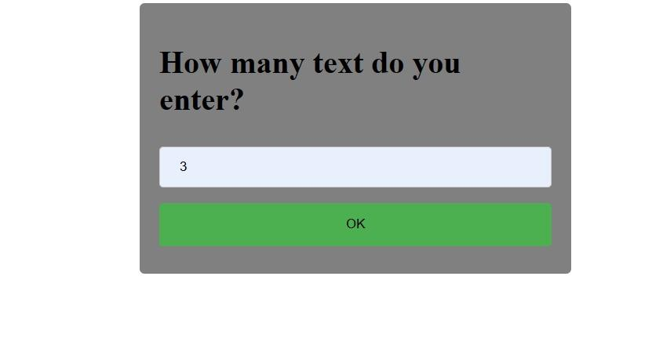
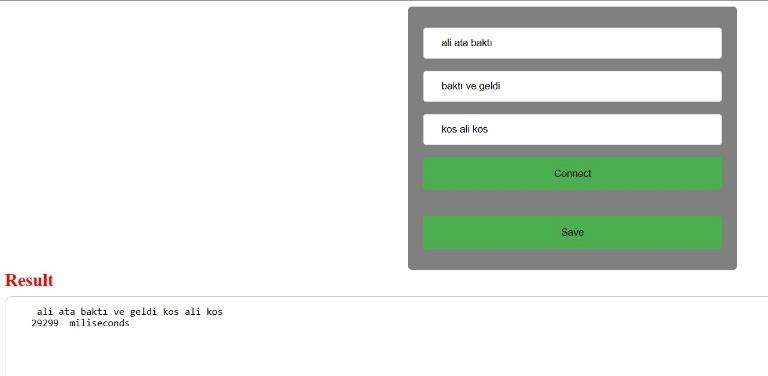
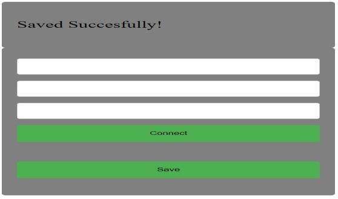
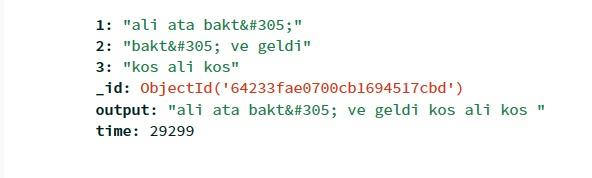
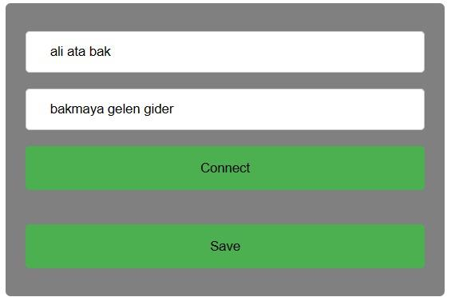
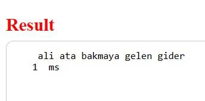

# Combining Two Or More Texts Properly (İki veya Daha Fazla Metnin Uygun Bir Şekilde Birleştirilmesi)

***Bu*** ***projede*** ***iki*** ***veya*** ***daha*** ***fazla***
***metnin*** ***uygun*** ***bir*** ***şekilde*** ***birleştirilmesi***
***problemi*** ***için*** ***yeni*** ***algoritmalar***
***geliştirmek*** ***amaçlanmaktadır.*** ***Devamında*** ***bunları***
***görsel*** ***bir*** ***arayüzle*** ***sunmanız*** ***beklenir***
***ve*** ***geliştirdiğimiz*** ***algoritmanın*** ***performans***
***özelliklerini*** ***ve*** ***çalışma*** ***sürelerini*** ***farklı***
***girdilerde*** ***karşılaştırılmalıdır.***

***Anahtar*** ***Kelimeler:*** ***Web*** ***App,*** ***NoSQL,***
***Metin*** ***İşleme***

**Projenin** **Özeti**

Yazılım laboratuvarı 2 projesi olarak bizden "İki veya Daha Fazla Metnin
Uygun Bir Şekilde Birleştirilmesi" adındaki bir uygulama yapılması
istendi. Bize projeyi tanıtan pdfte açıklanan toplam 3 ana isteri
uygulamaya çalıştık.

Biz bu proje için bizden istenenler doğrultusunda programlama
dillerinden back-end için Java, front-end dilleri arasından JSP,
Servlet, Javascript ve CSS, database olarakta MongoDB kullanmayı uygun
gördük.

Bu projede, kitap, dergi vb. gibi metinlerden elde edilen
cümleler/kelimeler arasındaki benzerlik, frekans gibi özelliklerin
bulunması, metinlerin birleştirip birleştirilmeyeceğine karar verilmesi
ve elde edilen verilerden karakter tabanlı cümlelerin/kelimelerin
birleştirilmesi beklenmektedir. Bu işlemlerin yapılması için gerekli
algoritma geliştirilecektir.

> **I.** **GİRİŞ**

Projeninkonusu "İki veya Daha Fazla Metnin Uygun Bir Şekilde
Birleştirilmesi" adındaki bir uygulama yapılması istendi. Bize projeyi
tanıtan pdfte açıklanan toplam 3 ana isteri uygulamaya çalıştık

Biz bu proje için bizden istenenler doğrultusunda programlama
dillerinden back-end için Java, front-end dilleri arasından JSP,
Servlet, Javascript ve CSS, database olarakta MongoDB kullanmayı uygun
gördük.

> **II.** **YÖNTEM**

Bu projede kullanılan yöntem 3 aşamada anlatılacaktır.

**1.Aşama** **(Back-End):** Öncelikle back-end işlemleri için bizden
Java dili kullanmamız istendiği için bu dille uygun olacak şekilde Jsp
ve Servlet kullanmayı karar verdik. İlk önce web arayüzünden gelecek
olan 2 veya daha fazla metinleri String tipindeki ArrayList içinde
tuttuk. Sonrasında bu gelen metinleri daha düzenli ve kolay işlemler
için String türündeki bir diziye aktardık. Metinleri birleştirme
işlemleri kelimeleri birleştirme ve cümleleri birleştirme şeklinde
olduğundan öncelikle bu metinler içinde " " karakteri olup olmadığına
göre işlem yollarını ayıran bir fonksiyon yazdık. Buna göre boşluk
içeren metinleri cümle birleştirmeye, aksi halde kelime birleştirme
işlemlerine yönlendirdik. Cümle birleştirmede öncelikle String tipinde 2
boyutlu bir dizi oluşturduk. Bu dizinin satır sayısı kaç tane metin
olduğu, sütun sayısı da bu metinlerin içinde bulunan kelime sayısıdır.
Sonrasında bu çift boyutlu dizinin ilk cümlesinin ilk kelimesi kaynak
olarak alınıp bir sonraki cümle içerisinde arama yaptık. Eğer aynı
kelimeyi diğer cümlede içeriyorsa bir sonraki cümlede o kelimenin
bulunduğu yereyeniden bu kelimenin kontrol edilmemesi için "x" işareti
koyduk. Sonra bu şekilde kelimeleri sırasıyla "ana_metin" ismindeki
değişkene sırayla ekledik. Böylece cümle birleştirme işlemini
tamamladık.

Kelime birleştirmede ise girilen kelimeleri öncelikle char dizilerine
çevirip aktardık. Bir döngü içerisinde bu char dizilerinin ilk
charlarını alıp bir sonraki char dizisinin ilk charı ile bir
karşılaştırma yaptık. Charların eşitlikleri bozulana kadar kelimelerin
önekini bulmaya çalıştık. Öneki bulunduktan sonra kelimelerin web
arayüzünden giriş sırasına göre öneki hariç diğer charları bu sıraya
göre önekin sonuna eklenir. Böylece kelime birleştirme işlemini de
bitirmiş olduk.

**2.Aşama** **(Front-End):** Jsp Java kodlarını HTML dosyası üzerinde
Servlet aracılığıyla dinamik bir web sitesi yapmamızı sağlar. Biz bu
projede HTML sayhfalrını Jsp formatında yaptık. Kullanıcıdan istediğimiz
inputları Servlet aracılığıyla Tomcat serverına request gönderilip
servlette oluşturduğumuz Java uzantılı dosyalarda alınan inputları
işledikten sonra cevabı response olarak Servlet yardımıyla ana Jsp
sayfalarımıza entegre ettik. Tabi ki Jsp sayfaları aynı zamanda HTML
sayfası olduğu için sayfamızın renkli görünmesi için CSS kullandık. Aynı
Jsp dosyası içine yazmaktansa ayrıca bir CSS dosyası oluşturmayı tercih
ettik. Kullanıcılar girdikleri

verileri bir database kaydetmemiz gerekiyordu. Bunun içinde Mongodb
Atlas Cloud kullandık. Database kaydedeceğimiz veriler sırasıyla
;

> • Girilen metinler
> 
> • Birleştirilmiş metin
>  
> • Zaman

Peki sayfalar arasındaki data transferini HttpSession ile yaptık.

Yukarıda görülen giriş ekranı (index.jsp) girilen metin girilen sayı
kadar text input adetini welcome.jsp sayfamızda görüntülemek için
kullanıcıdan bu veriyi alıyoruz.

Kullanıcı girdiği metinleri connect
butonuna tıkladığında ConnectServlet.java servlet serverda get edilen
requesti alıp 1.aşamada uygulanan işlemler sonucunda sonucu session
kullanarak tekrar welcome.jsp sayfamıza yönlendirip result altında
bulunan textarea içine yazdırıyoruz. Kullanıcı birleştirdiği metinleri
kaydetmek istediğinde save butonuna tıkladığında aşağıdaki gibi bir
görselle karşılaşacaktır.

Resimde de görüldüğü gibi kullanıcı burada başarılı bir kayıt yapmıştır.
Peki kaydımız nerede tutulmaktadır. Burada da yukarıda bahsettiğimiz
gibi Mongodb databaseini kullandık aşağıda da örnek bir kayıt
görülmektedir.

Oluşturulan Classlar :

>• index.jsp
>
>• WelcomeServlet.java • Welcome.jsp
>
>• ConnectServlet.java
>
>• MongoDbConnection.java • SaveDb.java
>
>• FormStyle.css

 Kullanılan programlar: Eclipse, MongoDb Atlas

>**SÖZDE** **KOD**

1-BAŞLA

2-Kullanıcıdan input sayısını AL

3-EĞER kullanıcı 2'den küçük değer girerse GİT 2

4-Alınan input sayısı kadar giriş inputları OLUŞTUR

5-Connect butonuna tıklanırsa sonuçları GÖSTER

6- EĞER giriş inputları boşsa sonuç gösterme GİT 4

7- EĞER sonuçlar gözüktüyse save butonunu aktif et

8- EĞER save butonuna tıklandıysa datayı kayıt yap

9-BİTİR

> **III.** **DENEYSEL** **SONUÇLAR**

> **IV.** **SONUÇ**

Bu projede iki veya daha fazla metnin uygun bir şekilde birleştirilmesi
problemi için yeni algoritmalar geliştirmek amaçlandı. Devamında bunları
görsel bir arayüzle sunduk ve Geliştirdiğimiz algoritmanın performans
özelliklerini ve çalışma sürelerini farklı girişlere göre birbirleriyle
karşılaştırıp gözlem yaptık.

Devamında, kitap, dergi vb. gibi metinlerden elde edilen
cümleler/kelimeler arasındaki benzerlik, frekans gibi özelliklerin
bulunması, metinlerin birleştirip birleştirilmeyeceğine karar verilmesi
ve elde edilen verilerden karakter tabanlı cümlelerin/kelimelerin
birleştirilmesi gibi metin düzenleme algoritmalarının nasıl çalıştığı
ile ilgili bilgi edindik. Bu işlemlerin yapılması için gerekli algoritma
yapılan araştırmalar ışığında uygulamaya çalıştık.

> **KAYNAKLAR**

1\. https://devpractical.com/center-form-in-html-css/

2\. https://linuxhint.com/clear-input-fields-javascript/

3\. https://stackoverflow.com/questions/5467038/adding-3rd-party-jars-to-web-inf-lib-automatically-using-eclipse-tomcat

4\. https://stackoverflow.com/questions/40600602/how-to-display-arraylist-objects-in-jsp-using-session-getattribute

5\. https://stackoverflow.com/questions/10198893/how-to-display-results-on-same-page-as-requesting-page-in-jsp-servlets

6\. https://www.educba.com/jsp-getparameter/ 

7\. https://kod5.org/jsp-session-implicit-object-12/

8\. https://stackoverflow.com/questions/41588024/calling-method-onclick-of-jsp-form-jsp

9\.https://digitalfox-tutorials.com/tutorial.php?title=How-to-add-remove-input-fields-dynamically-using-javascript

10\. https://www.w3schools.com/jsref/prop_nodeinnertext.asp

11\. https://www.w3schools.com/jsref/eventonclick.asp

12\.https://developer.mozilla.org/en-US/docs/Web/HTML/Element/input/hidden

